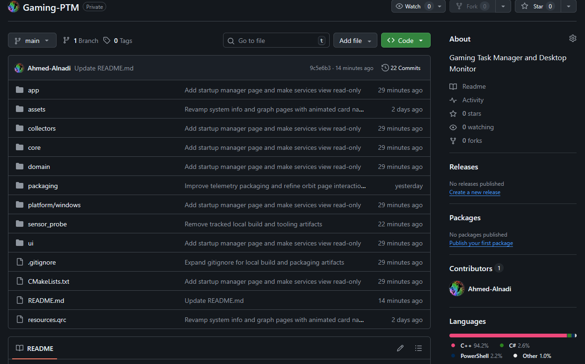
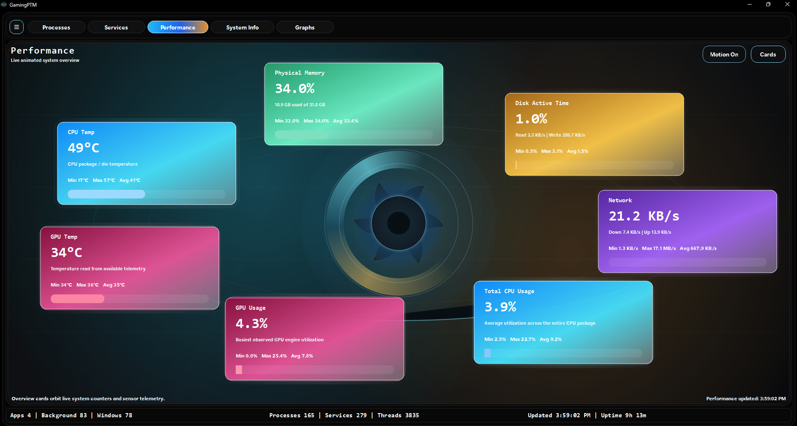
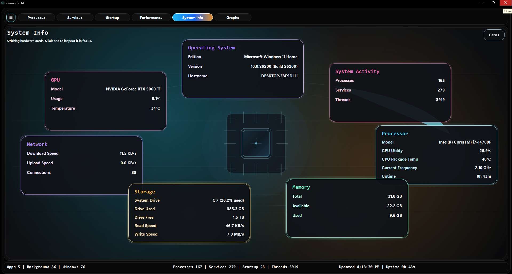
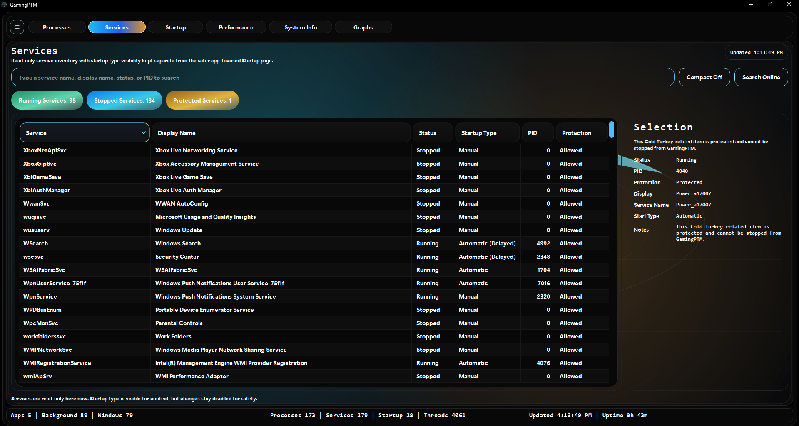
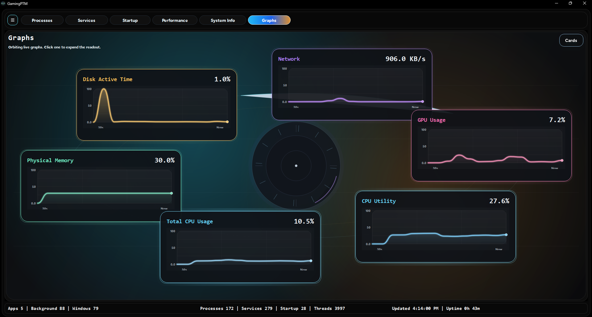

# GamingPTMShowcase
## GamingPTM App

## 
GamingPTM is a Windows desktop system monitoring application built to provide a richer, more visual alternative to Task Manager. It lets users inspect running processes, Windows services, startup programs, live system performance, hardware details, and sensor data through a custom multi-page interface with searchable tables, animated cards, and graphs.

The app combines native Windows APIs with hardware telemetry paths to surface CPU, memory, disk, network, and GPU information, while also giving users visibility into startup behavior and overall system activity. It is designed to be both more informative and more visually polished than the default Windows monitoring tools.

These rotate btw, it looks cool!

